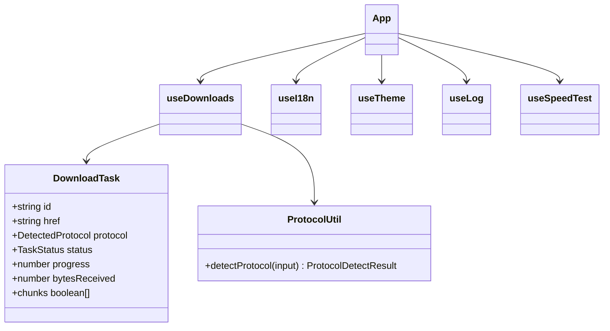

# any-downloader-web — 类图（逻辑视图）

```mermaid
classDiagram
  class DownloadTask {
    +string id
    +string href
    +DetectedProtocol protocol
    +TaskStatus status
    +number progress
    +number bytesReceived
    +chunks boolean[]
  }
  class ProtocolUtil {
    +detectProtocol(input) ProtocolDetectResult
  }
  App --> useDownloads
  App --> useI18n
  App --> useTheme
  App --> useLog
  App --> useSpeedTest
  useDownloads --> DownloadTask
  useDownloads --> ProtocolUtil
```

> 说明：Vue 3 组合式 API 以函数模块为主，上图为职责等价抽象。
